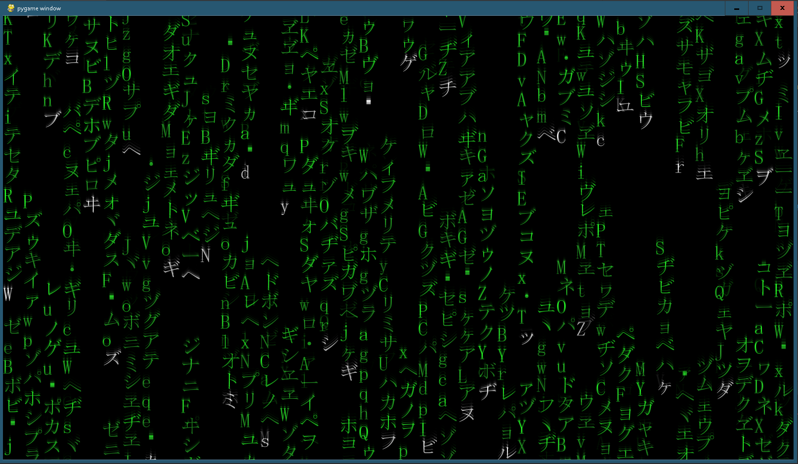
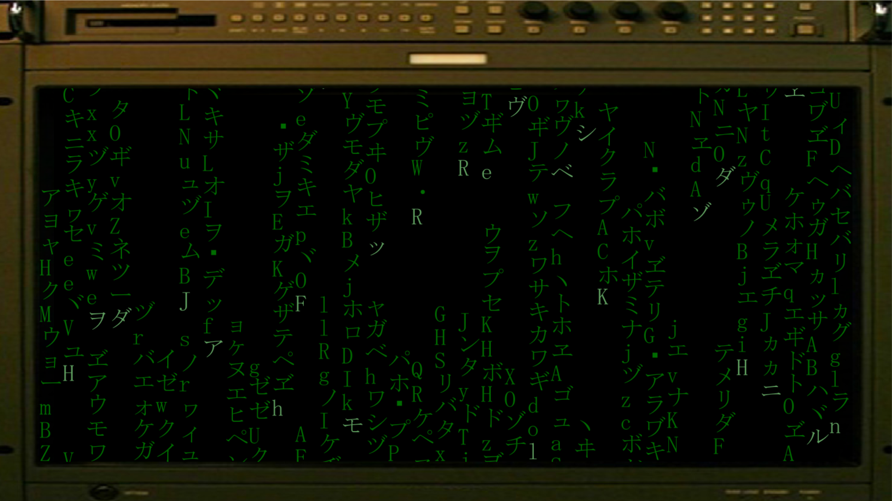
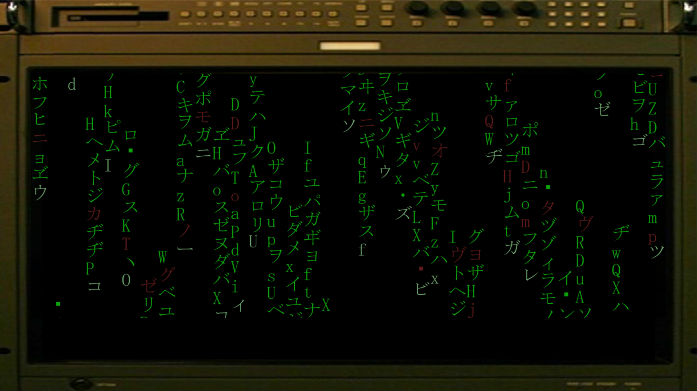
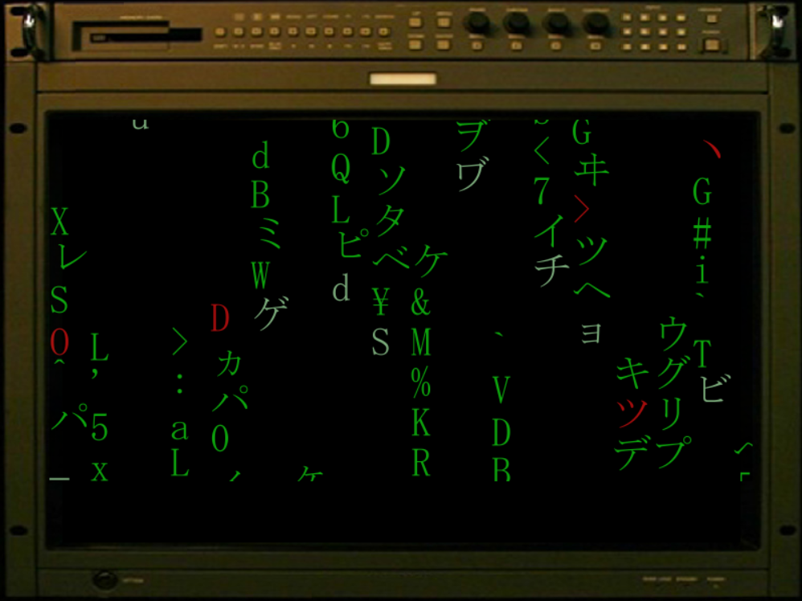
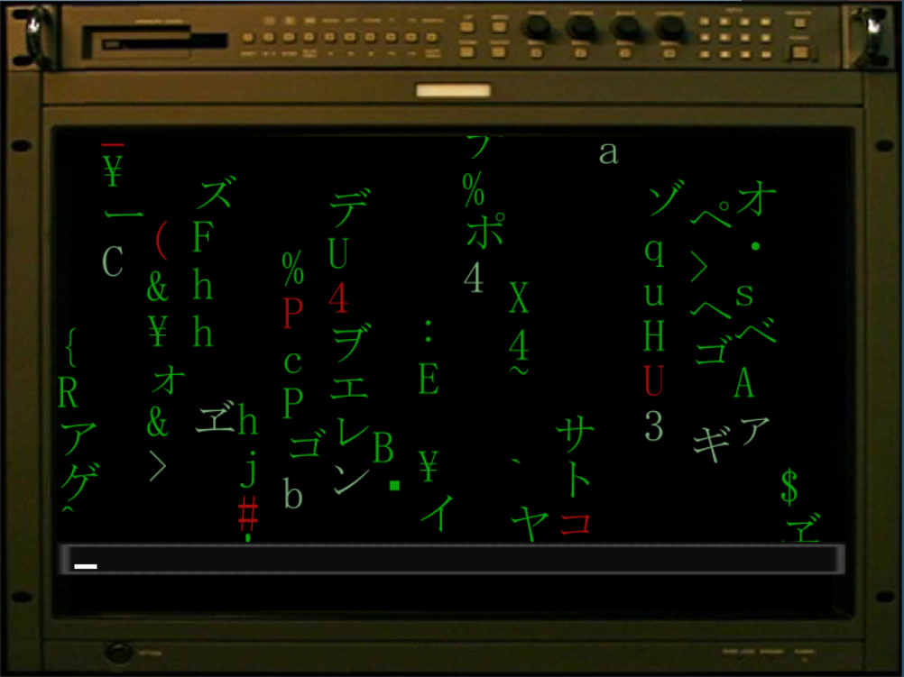
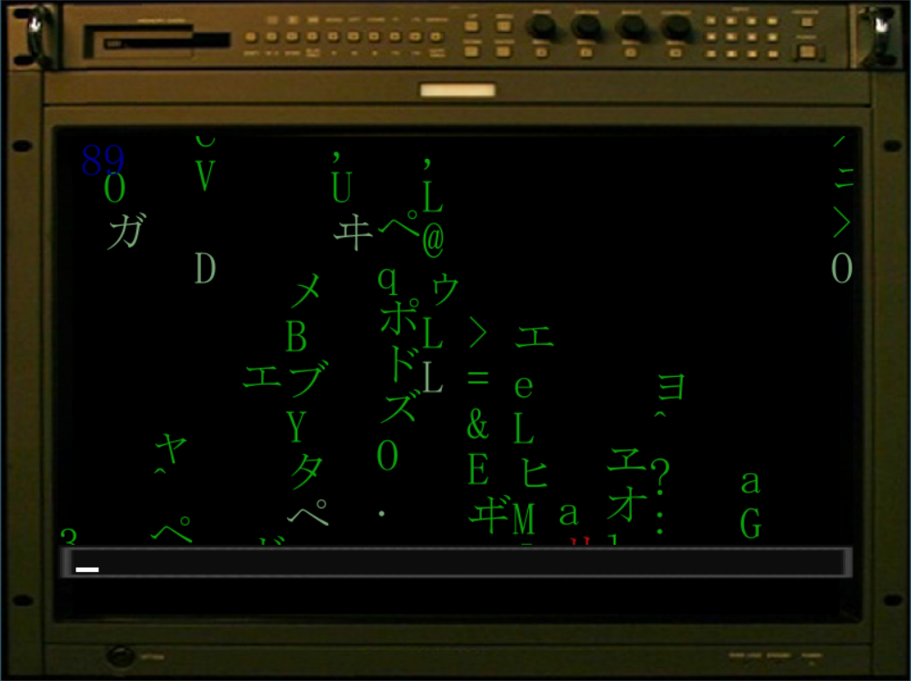
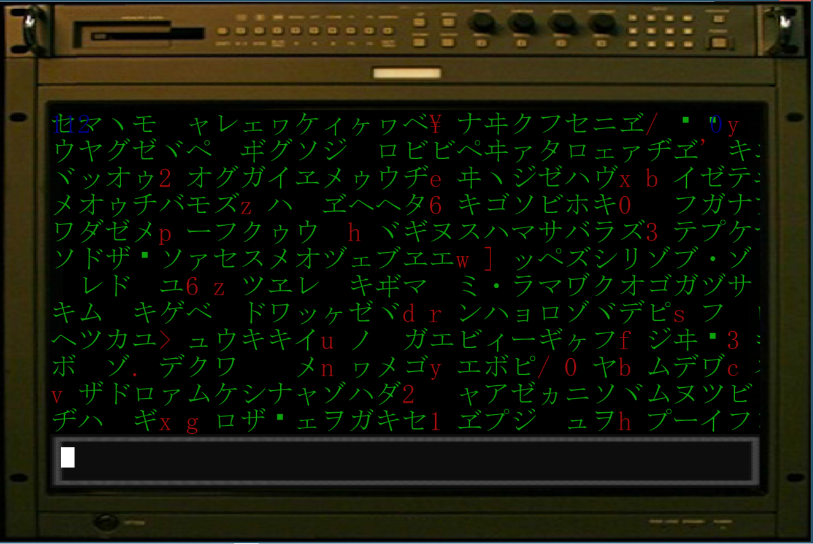

#  MATRICKS
̶MATRICKS in Python with Pygame

This is a fork of the original (MATRIX-Digital-Rain). Plan to add more features.
Going to make text look more like movie.
Using these videos for comparison
Video 1 - https://www.youtube.com/watch?v=MvEXkd3O2ow
Video 2 - https://www.youtube.com/watch?v=m150jhSSj0g
Video 3 - https://www.youtube.com/watch?v=pqqEriE0ogc

Features added:
* English Symbols

* Monitor Boarder
* Settings file

* Red Corruption added to symbols
* Length of columns now scales with resolution (Solves collisions)
* Space made at bottom of screen for capture bar

* Added more symbols
* Added numbers
* Resolution scaling seems solid

* Add Capture Bar at bottom
* Add CLI Cursor

* Add Timer 

* Add Point Display
* Accept Spacebar input

* Removed scrolling

Possible future features:

* Randomize text size / alignment
* Define Grid
* Column Matrix Rain (Sequential Symbol Change)
* Speed up text drop, add random stop at bottom
* Add GUI (QT Designer)
* Add Home screen
* Add Settings Screen
* Add Mini Games
* Improve Point System
* Improve Typing input
* Use Capture Bar for Typing Game
* Add Coding (Information gathering)
* Borderless Window

Known Issues:
* Lines shouldn't scroll, digits should be added (See Video 2)
* Hardcoded settings cause outdated settings.json. Delete file for defaults to reload is temp fix, until settings menu. 
* Non 16:9 aspect ratio crashes game

Gather information by correctly typing falling keys.
Information unlocks passcodes used to dial-in.
Complete Mini Game to gain points for upgrades.
Define leveling system.
Define new ways to code (Typing features, Combos)
Define different types of information (From Combos)
Define equipment to spend points on (Upgrades)